# Ping Music 📻 
### 💻 PC网页版 [PingMusic](https://ping-music-next.vercel.app/#/musicHall) `登录体验更多精彩`   
>🎤 一款第三方网易云音乐播放器  
>🎼 采用 Vue 3 + Typescript + Vite 2 开发  
>🔊 API来自 [Binaryify/NeteaseCloudMusicApi](https://github.com/Binaryify/NeteaseCloudMusicApi)  
>🎧 UI灵感来源QQ音乐、Apple Music
---
 

# ⚙️ 项目技术栈
## 📯 Vue v3.x
## 🎺 Vite v2.x
## 🎸 Vue Router v4.x
## 🥁 Vuex v4.x
## 🎹 Typescript
 

# 🎨 功能
## 🎆支持登录网易云账号，收听私人歌单，收藏喜欢音乐
## 🎇 精选推荐
## ✨ 独家放送
## 🎉 分类歌单
## 🎊 排行榜单
## 🎄 歌手浏览
## 🎋 新歌速递
## 🎍 视频MV播放
## 🎏 歌单详情
## 🎐 歌手详情
## 🎑 播放界面
## 🔧 部分功能有待完善
## 🔨 更多功能正在开发中
 

# 🌈 界面截图

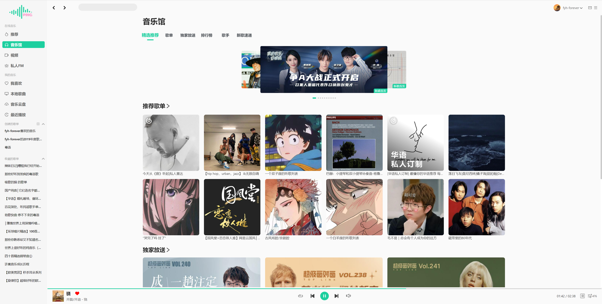
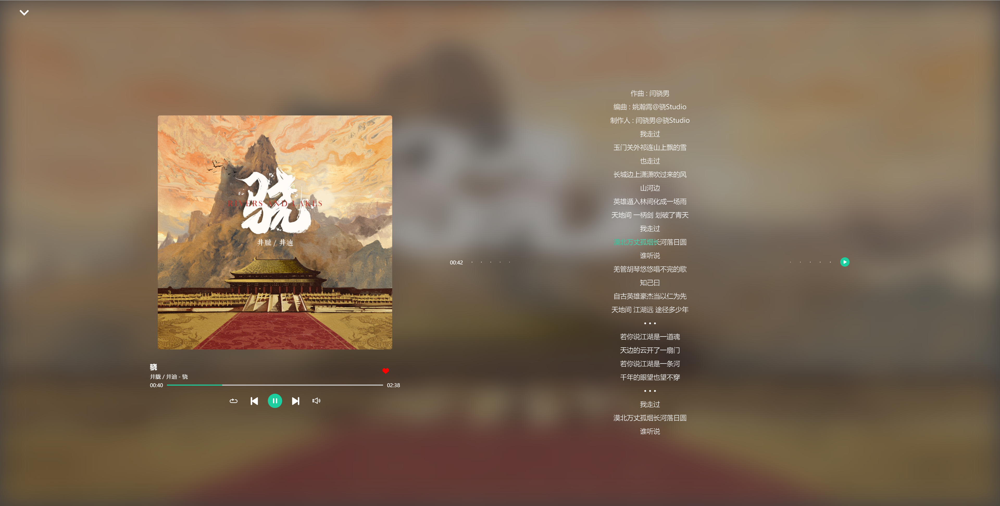

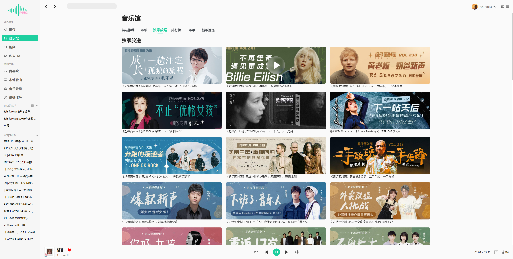
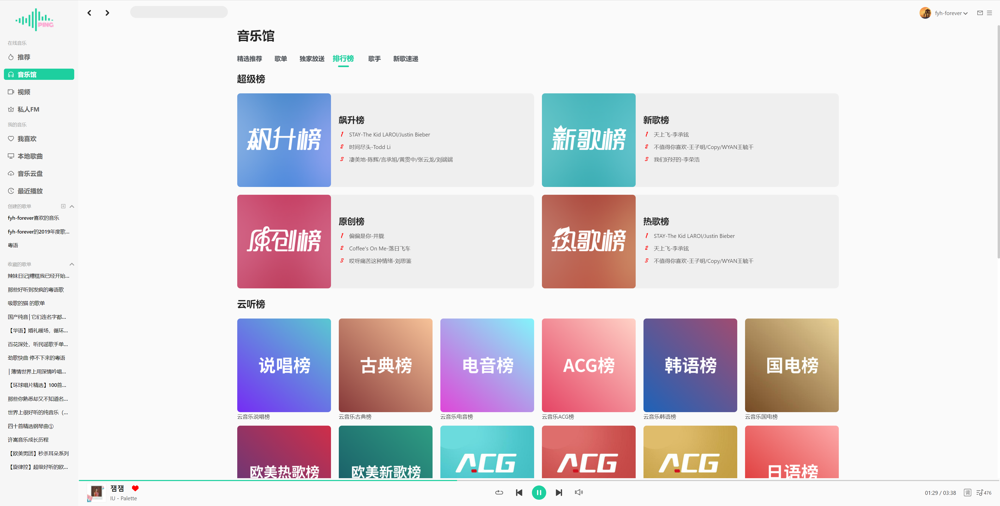
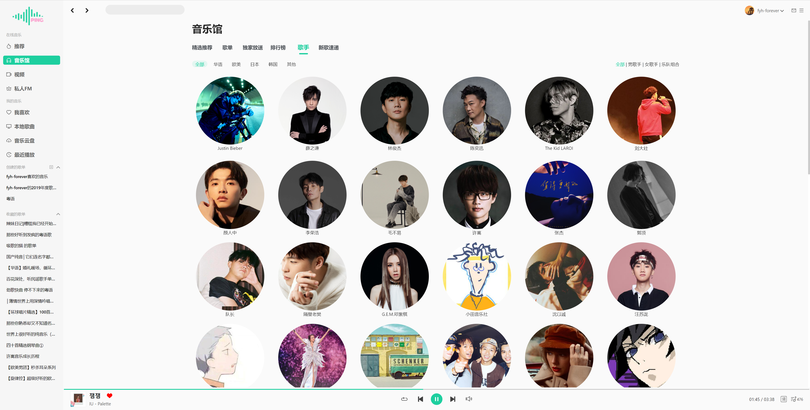
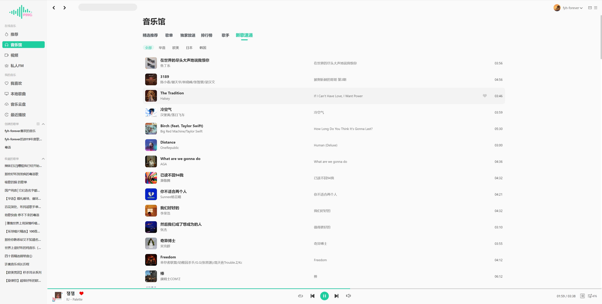
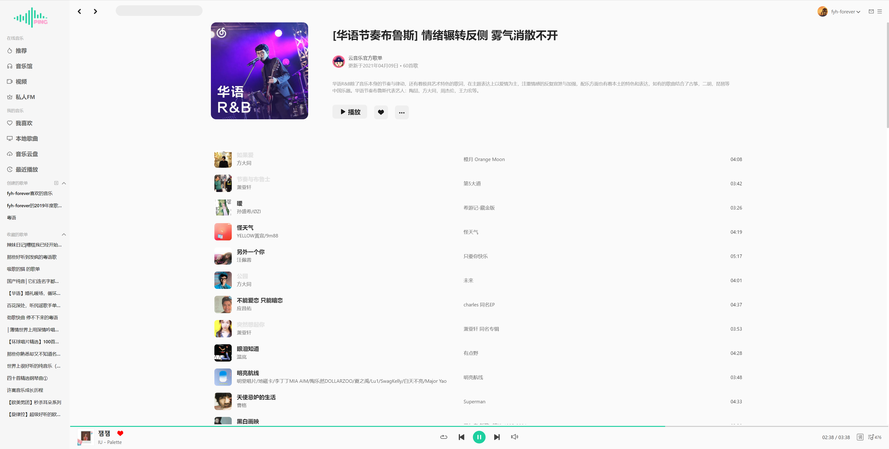
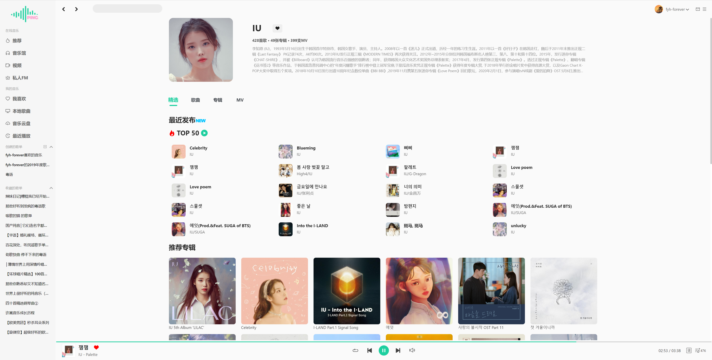
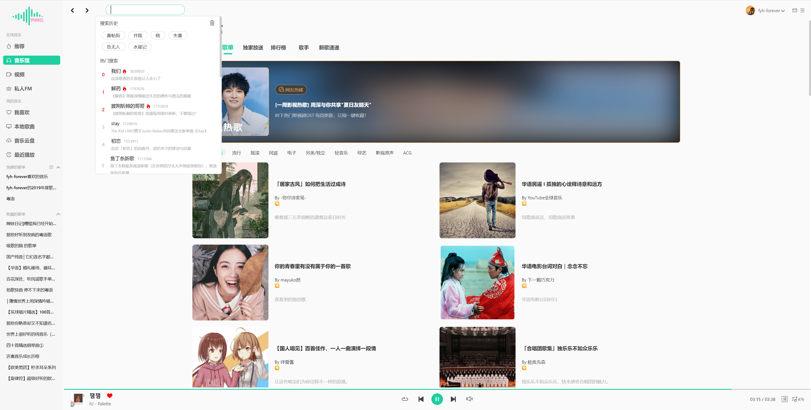
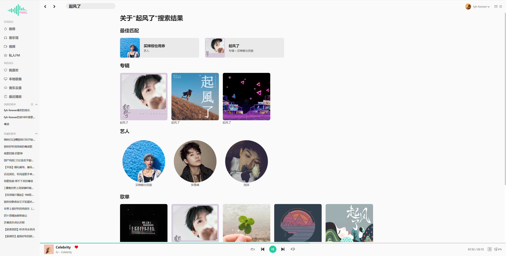
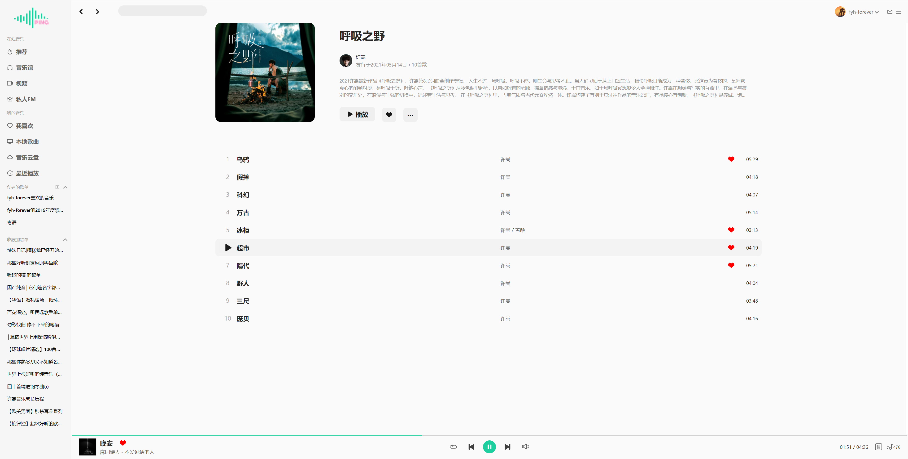
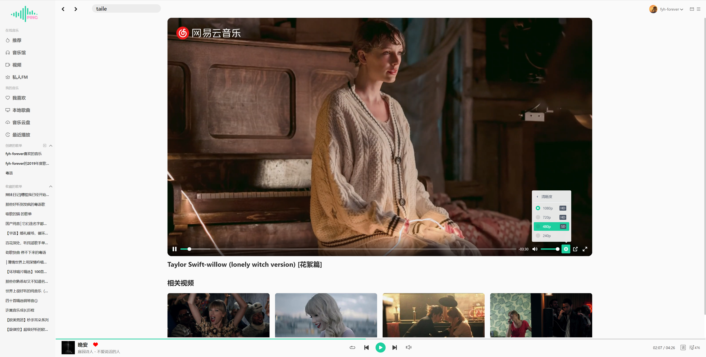

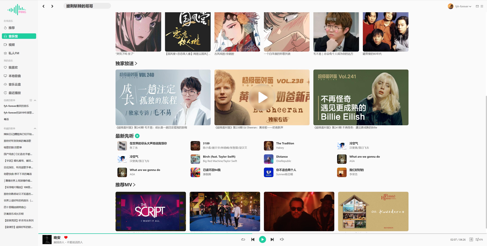
